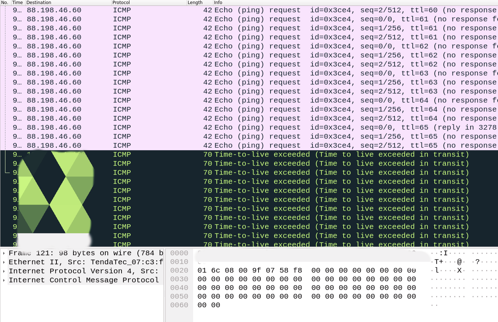

 &nbsp;&nbsp;&nbsp;
 &nbsp;&nbsp;&nbsp;
 &nbsp;&nbsp;&nbsp;
 &nbsp;&nbsp;&nbsp;

# KAE0 — Network Traceroute Tool

####  <p align="center">KAE0 is a network troubleshooting tool that traces the path packets take from your computer to a target host, similar to the classic traceroute. It sends ICMP packets with increasing Time-To-Live (TTL) values and measures the Round-Trip Time (RTT) for each hop. It also resolves router IPs to hostnames when possible and color-codes RTTs for easy visualization.<p> 
**Version:** 01.0


## Sturcture: 
```
    Mtraceroute/
    ├── bin/                  # Compiled binary of the traceroute program
    ├── include/              # Header files declaring functions and structures
    ├── src/                  # Source files implementing functionality
    ├── utils/                # Helper functions and utilities
    ├── kaeo.sh               # Wrapper script to run traceroute with sudo
    └── readme.md             # Project description and usage guide
```
## Dependencies:
```
C++17 or later — utilizes standard library components such as <vector>, <unordered_map>, and <chrono>.
Linux / Unix environment — requires POSIX headers including <arpa/inet.h>, <netinet/ip.h>, <netinet/ip_icmp.h>, <sys/socket.h>, <sys/epoll.h>, <fcntl.h>, and <unistd.h>.
libpcap — essential for packet capture (sudo apt install libpcap-dev).
g++ compiler — for building the program; Make is optional for automated compilation.
Administrative privileges may be necessary to capture raw ICMP packets.
```
## How to Run:
 &nbsp;&nbsp;&nbsp;
  &nbsp;&nbsp;&nbsp;
```
    Open a terminal and navigate to the Mtraceroute folder:
    1> make
    2> ./kaeo.sh <target>
```
## Example Output
```
    -> Router IP: 192.168.1.1
    ---> Router Name: Unknown
       > RTT: 13.899ms | 14.115ms | 14.228ms
       > Seq: 1 | Avg RTT: 14.080ms
```
## Wireshark Capture


#### The outgoing ICMP packets are captured in pink, while the replies from intermediate routers (hops) are shown in black.

